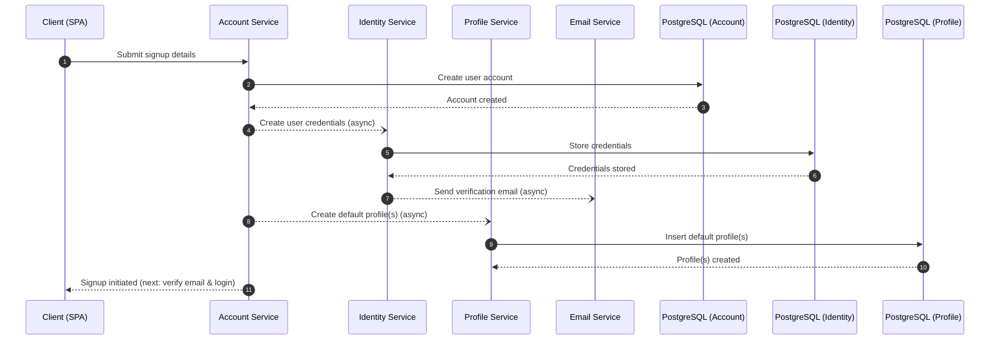
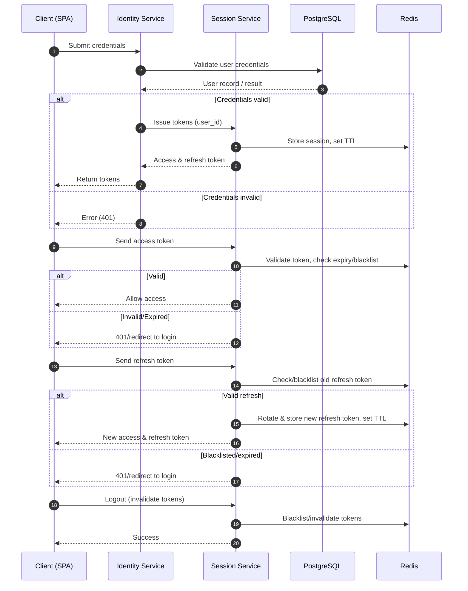
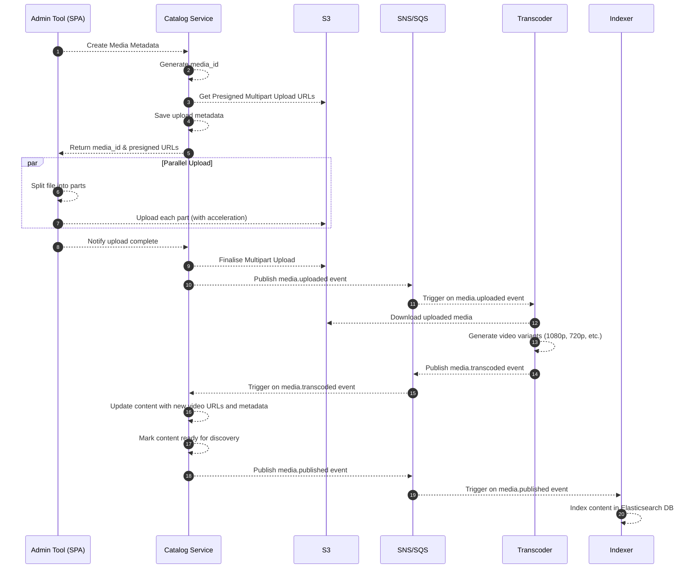
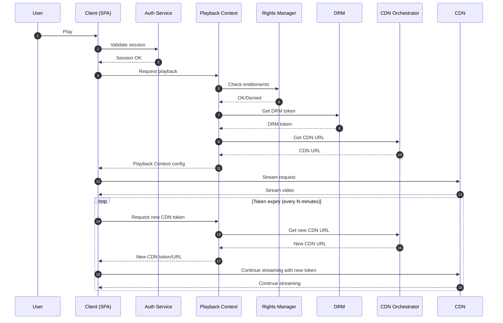

# Streamix Video Streaming Platform

This repository serves as the **central hub** for **Streamix**, a cloud-native, microservices-based application designed to deliver a scalable, reliable and high-performance video streaming experience.

It provides an overview of the system architecture and links to all individual microservices, acting as the single entry point for developers, maintainers and reviewers.

## Table of Contents

* [Introduction](#introduction)
* [High-Level Architecture](#high-level-architecture)
* [Service Flow Diagrams](#service-flow-diagrams)
  * [Registration Flow](#registration-flow)
  * [Authentication Flow](#authentication-flow)
  * [Media Upload Flow](#media-upload-flow)
  * [Streaming Flow](#streaming-flow)
* [Implemented Services](#implemented-services)
* [Platform Services Overview](#platform-services-overview)
  * [Frontend Applications](#frontend-applications)
  * [Infrastructure Cluster](#infrastructure-cluster)
  * [Auth Cluster](#auth-cluster)
  * [Users Cluster](#users-cluster)
  * [Media Cluster](#media-cluster)
  * [Streaming Cluster](#streaming-cluster)
  * [Discovery Cluster](#discovery-cluster)
  * [Engagement Cluster](#engagement-cluster)
  * [Comms Cluster](#comms-cluster)
  * [Billing Cluster](#billing-cluster)
  * [Analytics Cluster](#analytics-cluster)
  * [Support Cluster](#support-cluster)
* [Technology Stack](#technology-stack)
  * [Frontend](#frontend)
  * [Backend](#backend)
  * [Infrastructure](#infrastructure)
  * [Service Communication](#service-communication)
* [Deployment](#deployment)
  * [Prerequisites](#prerequisites)
  * [Deployment Process](#deployment-process)
  * [CI/CD](#cicd)
* [License](#license)
* [Contact](#contact)

## Introduction

The **Streamix** is a modern, cloud-native solution that leverages a microservices architecture to deliver a scalable and high-performance streaming experience. Designed for flexibility and resilience, it divides key functionalities into dedicated services, including user management, media catalog, streaming, search, recommendations, authentication and more.

Key features of the platform include:
- **Microservices-based architecture**: Each core function is implemented as an independent service, promoting modularity, maintainability and scalability.
- **Cloud-native deployment**: Utilises containerisation and orchestration to support dynamic scaling and high availability.
- **Robust communication**: Integrates REST, gRPC and asynchronous messaging to ensure efficient and reliable inter-service communication.
- **Centralised configuration and service discovery**: Leverages Spring Cloud Config and Eureka for streamlined configuration management and dynamic service registration.

This hub repository is the starting point for understanding, deploying and maintaining the entire platform. It provides architecture diagrams, technology stack information and direct links to each microservice repository to ensure that developers and stakeholders can easily navigate and contribute to the system.

## High-Level Architecture

The platform is built on a modern, cloud-native architecture that divides key platform functionalities into dedicated microservices, each deployed within its own cluster. This modular approach allows each service to scale independently, ensures high availability, and enables rapid feature development and deployment.

The high-level architecture diagram below illustrates how frontend clients interact with the platform's core infrastructure and service clusters. Each cluster contains independent microservices with their own dedicated databases, ensuring data consistency and service autonomy.

  

At the heart of the architecture is the **API Gateway**, which serves as the single entry point for all client requests. It provides routing, authentication, rate-limiting and request aggregation, simplifying client interactions while abstracting the complexity of the underlying microservices.

Microservices are organised into logical clusters based on their core responsibilities. Inter-service communication uses a combination of **REST**, **gRPC** and asynchronous messaging (**Kafka**, **RabbitMQ**), ensuring efficient and reliable data exchange even under high load.

Centralised configuration management is provided via **Spring Cloud Config**, enabling consistent, environment-specific configuration across all microservices. **Eureka** acts as the service registry, supporting dynamic service discovery and load balancing.

## Service Flow Diagrams

This section presents clear, high-level flow diagrams for the platform's core clusters, including `Auth`, `Media`, and `Streaming`. These diagrams illustrate key service interactions within each domain.

### Registration Flow

Describes how new user accounts are created, covering the roles of the Account, Identity, Profile and Email services in onboarding users before their first login.

### Authentication Flow

It details how user credentials are securely verified, how access and refresh tokens are generated and rotated, and how user sessions are managed to ensure safe, seamless access to the platform's services.

### Media Upload Flow

Describes the end-to-end process for uploading new media assets to the platform by the admins, covering how files are ingested, processed, and stored by backend services.

### Streaming Flow

Shows the typical flow for content playback, detailing how user requests are authenticated, playback is authorised and content is securely streamed via the CDN.

## Implemented Services

The following services are currently implemented and actively maintained. They are also listed in the [Platform Services Overview](#platform-services-overview) section below, where each service is grouped under its relevant cluster for more detailed context:

- **Config Server** → [streamix-infra-config](https://github.com/mzilin/streamix-infra-config)  
  Manages externalised configuration using Spring Cloud Config.

- **Discovery Service** → [streamix-infra-discovery](https://github.com/mzilin/streamix-infra-discovery)  
  Provides service registration and discovery with Eureka.

- **API Gateway** → [streamix-infra-gateway](https://github.com/mzilin/streamix-infra-gateway)  
  Routes external requests to backend services, managing authentication, rate limiting, and aggregation.

- **Identity Service** → [streamix-auth-identity](https://github.com/mzilin/streamix-auth-identity)  
  Handles user authentication, credential management, and manages access and refresh tokens, including their validation and rotation.
  <!-- Handles user authentication and credential management. -->

<!-- - **Session Service** → [streamix-auth-session](https://github.com/mzilin/streamix-auth-session)  
  Manages access and refresh tokens, including validation and rotation. -->

- **Account Service** → [streamix-users-account](https://github.com/mzilin/streamix-users-account)  
  Stores and manages user account details.

- **Profile Service** → [streamix-users-profile](https://github.com/mzilin/streamix-users-profile)  
  Manages user preferences and personalisation.

- **Catalog Service** → [streamix-media-catalog](https://github.com/mzilin/streamix-media-catalog)  
  Stores metadata for media content, including titles and cast, and manages secure media uploads.

<!-- - **Transcoder Service** → [streamix-media-transcoder](https://github.com/mzilin/streamix-media-transcoder)  
  Converts uploaded media into various streaming formats to ensure compatibility across devices. -->

<!-- - **Search Service** → [streamix-discovery-search](https://github.com/mzilin/streamix-discovery-search)  
  Provides full-text and filtered search across media. -->

- **Email Service** → [streamix-comms-email](https://github.com/mzilin/streamix-comms-email)  
  Sends transactional and marketing emails.

## Platform Services Overview

This section outlines all core components of **Streamix**, including their current development statuses, descriptions and links to individual repositories.

Services are labelled with one of the following statuses:

- `Planned`: Service is scheduled for future development.
- `Pending`: Service is under consideration but not yet prioritised.
- `Concept Only`: Service is a conceptual idea that may be explored in the future.

### Frontend Applications

User-facing applications delivering the video streaming experience across web, mobile and smart TVs.

- **Web App** - `Planned`

    Provides the main user interface for desktop and laptop users, supporting media browsing, playback, and account management.

- **Mobile App** - `Concept Only`

    Delivers the platform experience to iOS and Android users, including video playback, offline support, and push notifications.

- **Smart TV App** - `Concept Only`

    Designed for smart TVs and streaming devices, offering a lean-back experience optimised for large screens and remote controls.

### Infrastructure Cluster

Core infrastructure components that support all other services, including configuration management, service discovery and API routing.

- **Config Server** - [streamix-infra-config](https://github.com/mzilin/streamix-infra-config)
    
    Manages externalised configuration for all services using Spring Cloud Config, enabling dynamic configuration updates and environment-specific settings.

- **Discovery Service** - [streamix-infra-discovery](https://github.com/mzilin/streamix-infra-discovery)

    Provides dynamic service registration and discovery using Spring Cloud Netflix Eureka, allowing microservices to locate and communicate with each other seamlessly.

- **API Gateway** - [streamix-infra-gateway](https://github.com/mzilin/streamix-infra-gateway)

    Routes external client requests to the appropriate microservices using Spring Cloud Gateway, handling authentication, rate limiting and request aggregation.

- **Chaos Monkey** - `Pending`

    Injects faults and simulates failures in services using Spring Cloud Chaos Monkey, helping to test the platform's resilience and fault tolerance.

### Auth Cluster

Manages user authentication, session management and third-party login integrations.

- **Identity Service** - [streamix-auth-identity](https://github.com/mzilin/streamix-auth-identity)

    Handles user authentication, storing and verifying credentials securely.

- **Session Service** - `Planned`

    Controls access and refresh tokens, including validation, rotation and token blacklisting.

- **OAuth2 Service** - `Concept Only`

    Supports third-party login integrations, managing linked identities.

### Users Cluster

Handles user-related data such as account details, profiles, watchlists and device management.

- **Account Service** - [streamix-users-account](https://github.com/mzilin/streamix-users-account)

    Stores and manages core user account information.

- **Profile Service** - [streamix-users-profile](https://github.com/mzilin/streamix-users-profile)

    Manages user profiles, preferences and personalisation settings.

- **Watchlist Service** - `Pending`

    Allows users to save and manage a list of shows and films to watch later.

- **Devices Service** - `Concept Only`

    Tracks registered user devices and session history (e.g. IP, location, timestamps).

### Media Cluster

Manages all aspects of media management, including uploads, transcoding, DRM and licensing.

- **Catalog Service** - [streamix-media-catalog](https://github.com/mzilin/streamix-media-catalog)

    Stores metadata for all media, including titles, genres, trailers, and cast information, and manages secure media uploads.

- **Transcoder Service** - `Planned`

    Converts uploaded media into various streaming formats to ensure compatibility across devices.

- **DRM Service** - `Concept Only`

    Secures content with encryption and manages playback rights to prevent unauthorised use

- **Geo-Restrictions Service** - `Concept Only`

    Controls content availability based on users’ geographic locations.

- **Content Moderation Service** - `Concept Only`

    Reviews uploaded content to ensure it complies with community standards and legal guidelines.

- **Release Scheduler Service** - `Concept Only`

    Controls when content is published and how long it remains available for viewing.

- **Licensing Service** - `Concept Only`

    Tracks and manages content licensing agreements and rights management.

### Streaming Cluster

Delivers streaming services, including content delivery, playback management and CDN integration.

- **Playback Context Service** - `Planned`

    Builds real-time playback sessions, including entitlements, resume points and user settings.

- **Rights Manager** - `Concept Only`

    Validates user permissions for content based on subscriptions, region and device type.

- **Watch History Service** - `Planned`

    Stores users' viewing history, including timestamps and resume positions.

- **CDN Orchestrator** - `Concept Only`

    Selects the best CDN edge node for each user, integrating with Open Connect.

- **Live Service** - `Concept Only`

    Supports live streaming events and real-time playback sessions.

- **Ad Inserter** - `Concept Only`

    Injects or signals ad content into live or on-demand streams.

- **Offline Manager** - `Concept Only`

    Manages downloads, licenses and expiry for offline viewing.

### Discovery Cluster

Provides search and discovery features, including search indexing, autocomplete and homepage content curation.

- **Search Service** - `Planned`

    Enables full-text and filtered searches across the media catalogue.

- **Autocomplete Service** - `Pending`

    Suggests relevant search terms and titles as users type.

- **Homepage Engine** - `Pending`

    Builds personalised content rows for users by combining recommendations, trending titles and viewing history.

- **Catalogue Indexer** - `Planned`

    Keeps Elasticsearch in sync with the media catalogue to ensure fast and accurate search results.

### Engagement Cluster

Drives user interaction with recommendations, trending content, A/B testing and advertising.

- **Recommender** - `Pending`

    Uses machine learning to suggest content based on user behaviour and history.

- **Trending Service** - `Pending`

    Identifies and showcases currently popular shows and films.

- **A/B Testing Service** - `Concept Only`

    Runs experiments on new features and content layouts to optimise user experience.

- **Advertising Service** - `Concept Only`

    Manages ad campaigns, targeting, scheduling and selection for live streams.

### Comms Cluster

Manages user communication via email, push notifications, in-app messaging and user preferences.

- **Notification Orchestrator** - `Pending`

    Handles routing and scheduling of messages across multiple channels.

- **Email Service** - [streamix-comms-email](https://github.com/mzilin/streamix-comms-email)

    Sends transactional and marketing emails to users.

- **Push Notification Service** - `Concept Only`

    Sends push notifications to mobile devices.

- **In-App Messaging Service** - `Planned`

    Delivers real-time messages to web and mobile apps via WebSockets.

- **SMS Service** - `Concept Only`

    Sends text messages via telecom providers.

- **Template Manager** - `Concept Only`

    Manages message templates for consistent communication across channels.

- **User Preferences Service** - `Concept Only`

    Handles user preferences for communication channels and notification settings.

### Billing Cluster

Handles payments, subscriptions, refunds and financial reconciliation.

- **Payments Service** - `Pending`

    Manages user payments using Stripe, Checkout, or similar services.

- **Invoicing Service** - `Concept Only`

    Generates and stores user invoices.

- **Subscriptions Service** - `Pending`

    Manages subscription plans, renewals and statuses.

- **Refunds Service** - `Concept Only`

    Processes user refund requests and tracks their status.

- **Disputes Service** - `Concept Only`

    Handles chargebacks and interactions with payment providers.

- **Reconciliation Service** - `Concept Only`

    Compares internal records with provider statements to identify mismatches.

### Analytics Cluster

Enables platform insights by collecting, analysing, and reporting data on content and user behaviour.

- **Event Collector Service** - `Concept Only`

    Ingests and batches user and system events.

- **Reporting Service** - `Concept Only`

    Generates dashboards and usage statistics.

- **Content Performance Service** - `Concept Only`

    Tracks views, engagement, and popularity of titles.

- **User Behaviour Service** - `Concept Only`

    Stores behaviour data for analysis and machine learning.

- **Anomaly Detector Service** - `Concept Only`

    Detects spikes, drops, or unusual patterns in metrics in real-time.

- **Data Quality Validator Srvice** - `Concept Only`

    Monitors pipelines for broken schemas and missing data.

- **Ad Metrics Service** - `Concept Only`

    Tracks ad impressions, durations and aggregates revenue/performance data.

### Support Cluster

Manages customer support, including ticketing and helpdesk integrations.

- **Ticketing Service** - `Concept Only`

    Handles customer support tickets and related workflows.

## Technology Stack

### Frontend
- Built as a **React** single-page application (SPA).
- Communicates with the backend via the **API Gateway**.
- Uses **HTTP-only JWT** cookies for authentication.

### Backend
- Microservices architecture with services grouped by business domain.
- **Spring Boot** for core business services.
- **Spring Cloud** provides service discovery, configuration and gateway routing.
- Polyglot persistence: each service owns its own database.

### Infrastructure
- Containerised deployments using **AWS ECS Fargate**.
- CI/CD pipeline using **GitHub Actions** for automated builds and deployments.
- Monitoring and observability with **Prometheus** and **Grafana**.

### Service Communication
- Services communicate using **REST**, **gRPC** and messaging systems (**RabbitMQ**, **Kafka**) depending on the use case and performance needs.

## Deployment

Each microservice in this platform is designed to be containerised and deployed consistently using Docker, with CI/CD pipelines for automated builds, tests and deployments.

### Prerequisites

Ensure you have the following installed on your machine:
- [Java JDK 21](https://www.oracle.com/uk/java/technologies/downloads/#java21)
- [Gradle 8.14](https://gradle.org/)
- [Docker](https://docs.docker.com/get-started/get-docker/)
- [Docker Compose](https://docs.docker.com/compose/)

### Deployment Process

Each microservice follows a similar deployment process:
1.	**Build**: The project is containerised using Docker and tagged with a version.
2.	**Push**: The built image is pushed to the **AWS ECR** container registry.
3.	**Deploy**: The image is pulled from the registry and deployed to the **AWS ECS** environment.
4.	**Monitor**: Logs and metrics are collected for operational monitoring.

### CI/CD

- **Continuous Integration**: All commits to key branches trigger automated build and test pipelines to ensure code quality.
- **Continuous Deployment**: When changes are merged into the `prod` branch, a deploy pipeline is triggered to build, push and deploy the service.
- **Secrets Management**: GitHub Secrets and environment variables are used to manage credentials and sensitive configurations.

## License

This project is private and proprietary. Unauthorised copying, modification, distribution or use of this software, via any medium, is strictly prohibited without explicit written permission from the owner.

## Contact

For any questions or clarifications about the project, please [reach out](https://www.mariuszilinskas.com/contact) to the project owner.

------
###### © 2024–present Marius Zilinskas. All rights reserved.