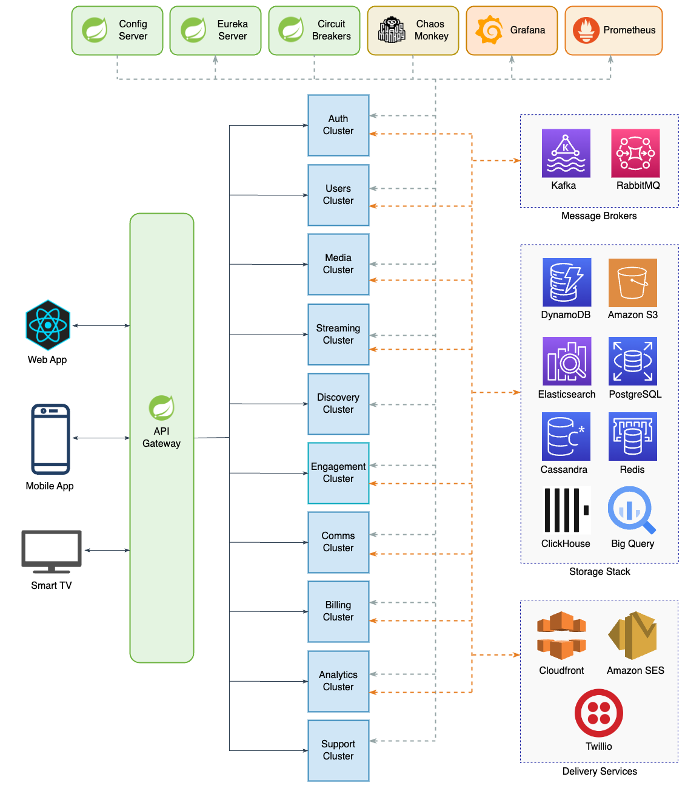

# Video Streaming Platform (VSP)

This repository serves as the **central hub** for the **Video Streaming Platform (VSP)**, a cloud-native, microservices-based application designed to deliver a scalable, reliable and high-performance video streaming experience.

It provides an overview of the system architecture and links to all individual microservices, acting as the single entry point for developers, maintainers and reviewers.

## Table of Contents

* [Introduction](#introduction)
* [High-Level Architecture](#high-level-architecture)
* [Microservices](#microservices)
  * [Statuses](#statuses)
  * [Frontend Apps](#frontend-apps)
  * [Infrastructure Services](#infrastructure-services)
  * [Core Backend Services](#core-backend-services)
    * [Auth Cluster](#auth-cluster)
    * [Users Cluster](#users-cluster)
    * [Media Cluster](#media-cluster)
    * [Streaming Cluster](#streaming-cluster)
    * [Discovery Cluster](#discovery-cluster)
  * [Supporting Backend Services](#supporting-backend-services)
    * [Engagement Cluster](#engagement-cluster)
    * [Comms Cluster](#comms-cluster)
    * [Billing Cluster](#billing-cluster)
    * [Analytics Cluster](#analytics-cluster)
    * [Support Cluster](#support-cluster)
* [Technology Stack](#technology-stack)
  * [Frontend](#frontend)
  * [Backend](#backend)
  * [Infrastructure](#infrastructure)
  * [Service Communication](#service-communication)
* [Deployment](#deployment)
  * [Prerequisites](#prerequisites)
  * [Deployment Process](#deployment-process)
  * [CI/CD](#cicd)
* [License](#license)
* [Contact](#contact)

## Introduction

The **Video Streaming Platform** is a modern, cloud-native solution that leverages a microservices architecture to deliver a scalable and high-performance streaming experience. Designed for flexibility and resilience, it divides key functionalities into dedicated services, including user management, media catalog, streaming, search, recommendations, authentication and more.

Key features of the platform include:
- **Microservices-based architecture**: Each core function is implemented as an independent service, promoting modularity, maintainability and scalability.
- **Cloud-native deployment**: Utilises containerisation and orchestration to support dynamic scaling and high availability.
- **Robust communication**: Integrates REST, gRPC and asynchronous messaging to ensure efficient and reliable inter-service communication.
- **Centralised configuration and service discovery**: Leverages Spring Cloud Config and Eureka for streamlined configuration management and dynamic service registration.

This hub repository is the starting point for understanding, deploying and maintaining the entire platform. It provides architecture diagrams, technology stack information and direct links to each microservice repository to ensure that developers and stakeholders can easily navigate and contribute to the system.

## High-Level Architecture

The platform is built on a modern, cloud-native architecture that divides key platform functionalities into dedicated microservices, each deployed within its own cluster. This modular approach allows each service to scale independently, ensures high availability, and enables rapid feature development and deployment.

The high-level architecture diagram below illustrates how frontend clients interact with the platform's core infrastructure and service clusters. Each cluster contains independent microservices with their own dedicated databases, ensuring data consistency and service autonomy.

  

At the heart of the architecture is the **API Gateway**, which serves as the single entry point for all client requests. It provides routing, authentication, rate-limiting and request aggregation, simplifying client interactions while abstracting the complexity of the underlying microservices.

Microservices are organised into logical clusters based on their core responsibilities. Inter-service communication uses a combination of **REST**, **gRPC** and asynchronous messaging (**Kafka**, **RabbitMQ**), ensuring efficient and reliable data exchange even under high load.

Centralised configuration management is provided via **Spring Cloud Config**, enabling consistent, environment-specific configuration across all microservices. **Eureka** acts as the service registry, supporting dynamic service discovery and load balancing.

## Microservices

This section outlines the core components of **VSP**, their current development statuses, and links to individual repositories where applicable.

### Statuses

- **Planned**: Service is scheduled for future development.
- **Pending**: Service is under consideration but not yet prioritised.
- **Concept Only**: Service is a conceptual idea that may be explored in the future.

### Frontend Apps

User-facing applications delivering the video streaming experience across web, mobile and smart TVs.

| Service Name | Description | Repository / Status |
|--------------|-------------|---------------------|
| Web App      | Provides the main user interface for desktop and laptop users, supporting media browsing, playback, and account management. | `Planned` |
| Mobile App   | Delivers the platform experience to iOS and Android users, including video playback, offline support, and push notifications. | `Concept Only` |
| TV App       | Designed for smart TVs and streaming devices, offering a lean-back experience optimised for large screens and remote controls. | `Concept Only` |

### Infrastructure Services

Essential infrastructure services, including configuration management, service discovery and API routing.

| Service Name | Description | Repository / Status |
|--------------|-------------|---------------------|
| Config Server | Manages externalised configuration for all services using Spring Cloud Config, enabling dynamic configuration updates and environment-specific settings. | [vsp-infra-config](https://github.com/mzilin/vsp-infra-config)   |
| Discovery Service | Provides dynamic service registration and discovery using Spring Cloud Netflix Eureka, enabling microservices to locate and communicate with each other seamlessly. | [vsp-infra-discovery](https://github.com/mzilin/vsp-infra-discovery) |
| API Gateway | Routes external client requests to the appropriate microservices using Spring Cloud Gateway, handling authentication, rate limiting, and request aggregation. | [vsp-infra-gateway](https://github.com/mzilin/vsp-infra-gateway) |
| Chaos Monkey | Injects faults and simulates failures in services using Spring Cloud Chaos Monkey, helping to test the platform's resilience and fault tolerance. | `Pending`                                                        |

### Core Backend Services

The backend microservices that power the platform, grouped by functional cluster for easy navigation.

#### Auth Cluster

Manages user authentication, session control and third-party login integrations.

| Service Name | Description | Repository / Status |
|--------------|-------------|---------------------|
| Identity Service | Handles user authentication, storing and verifying credentials securely. | [vsp-auth-identity](https://github.com/mzilin/vsp-auth-identity) |
| Session Service  | Controls access and refresh tokens, including validation, rotation and token blacklisting. | [vsp-auth-session](https://github.com/mzilin/vsp-auth-session) |
| OAuth2 Service   | Supports third-party login integrations, managing linked identities. | `Concept Only` |

#### Users Cluster

Handles user-related data such as account details, profiles, watchlists and device management.

| Service Name | Description | Repository / Status |
|--------------|-------------|---------------------|
| Account | Stores and manages core user account information. | [vsp-users-account](https://github.com/mzilin/vsp-users-account) |
| Profile | Manages user profiles, preferences and personalisation settings. | [vsp-users-profile](https://github.com/mzilin/vsp-users-profile) |
| Watchlist | Allows users to save and manage a list of shows and films to watch later. | `Pending` |
| Devices | Tracks registered user devices and session history (e.g. IP, location, timestamps). | `Concept Only` |

#### Media Cluster

Manages media content, including uploads, transcoding, DRM and licensing.

| Service Name | Description | Repository / Status |
|--------------|-------------|---------------------|
| Catalog | Stores metadata for all media, including titles, genres, trailers, and cast details. | [vsp-media-catalog](https://github.com/mzilin/vsp-media-catalog) |
| Upload | Handles media uploads to S3 for further processing and storage. | `Planned` |
| Transcoder | Converts media into different formats for streaming. | `Planned` |
| DRM (Digital Rights Management) | Protects content with encryption and controls playback rights. | `Concept Only` |
| Geo-Restrictions Manager | Restricts content availability based on geographic location. | `Concept Only` |
| Content Moderation | Ensures uploaded content meets community and legal standards. | `Concept Only` |
| Release Scheduler | Controls when content is published and for how long it's available. | `Concept Only` |
| Licensing Service | Manages content licensing agreements and rights. | `Concept Only` |

#### Streaming Cluster

Delivers streaming services, including content delivery, playback management and CDN integration.

| Service Name | Description | Repository / Status |
|--------------|-------------|---------------------|
| Delivery | Streams content to users using a CDN for high performance and scale. | `Planned` |
| Playback Context | Builds real-time playback sessions, including entitlements and resume data. | `Planned` |
| Rights Manager | Validates user permissions for content based on subscriptions, geo, and device. | `Concept Only` |
| Watch History | Stores user watch history, timestamps, and resume points. | `Planned` |
| CDN Orchestrator | Selects the best CDN edge node for each user, integrating with Open Connect. | `Concept Only` |
| Live | Handles live streaming events and real-time playback. | `Concept Only` |
| Ad Inserter | Injects or signals ad content into live or on-demand streams. | `Concept Only` |
| Offline Manager | Manages downloads, licenses, and expiry for offline viewing. | `Concept Only` |

#### Discovery Cluster

Provides search and discovery features, including search indexing, autocomplete and homepage content curation.

| Service Name | Description | Repository / Status |
|--------------|-------------|---------------------|
| Search | Provides full-text and filtered search on media catalogues. | [vsp-discovery-search](https://github.com/mzilin/vsp-discovery-search) |
| Autocomplete | Suggests search terms and titles as users type. | `Pending` |
| Homepage Engine | Builds personalised content rows for users by combining recommendations, trending titles, and viewing history. | `Pending` |
| Catalogue Indexer | Keeps Elasticsearch in sync with the media catalogue for fast search results. | `Planned` |

### Supporting Backend Services

Provides key platform enhancements such as user engagement, recommendations, communication, billing, analytics and support.

#### Engagement Cluster

Drives user interaction with recommendations, trending content, A/B testing and advertising.

| Service Name | Description | Repository / Status |
|--------------|-------------|---------------------|
| Recommender | Uses machine learning to suggest content based on user behaviour and history. | `Pending` |
| Trending | Identifies and displays currently popular shows and films. | `Pending` |
| A/B Testing | Runs experiments to test new features and content layouts. | `Concept Only` |
| Ads | Manages ad campaigns, targeting, scheduling, and selection for live streams. | `Concept Only` |

#### Comms Cluster

Manages user communication via email, push notifications, in-app messages and user preferences.

| Service Name | Description | Repository / Status |
|--------------|-------------|---------------------|
| Notification Orchestrator  | Routes and schedules messages across multiple channels. | `Pending` |
| Email | Sends transactional and marketing emails. | [vsp-comms-email](https://github.com/mzilin/vsp-comms-email) |
| Push (Apps) | Sends push notifications to mobile devices. | `Concept Only` |
| In-App (Websockets) | Delivers real-time messages within web and mobile apps via WebSockets. | `Planned` |
| SMS | Sends text messages via telecom providers. | `Concept Only` |
| Templates | Manages message templates for consistent formatting. | `Concept Only` |
| Preferences | Handles user communication preferences and settings. | `Concept Only` |

#### Billing Cluster

Handles payments, subscriptions, refunds and financial reconciliation.

| Service Name | Description | Repository / Status |
|--------------|-------------|---------------------|
| Payments | Processes payments using Stripe/Checkout/etc. | `Pending` |
| Invoicing | Generates and stores user invoices. | `Concept Only` |
| Subscriptions | Manages plans, renewals, and subscription statuses. | `Pending` |
| Refunds | Processes user refund requests and tracks their status. | `Concept Only` |
| Disputes | Handles chargebacks and interactions with payment providers. | `Concept Only` |
| Reconciliation | Compares internal records with provider statements to identify mismatches. | `Concept Only` |

#### Analytics Cluster

Enables platform insights by collecting, analysing, and reporting data on content and user behaviour.

| Service Name | Description | Repository / Status |
|--------------|-------------|---------------------|
| Event Collector | Ingests and batches user and system events. | `Concept Only` |
| Reporting | Generates dashboards and usage statistics. | `Concept Only` |
| Content Performance | Tracks views, engagement, and popularity of titles. | `Concept Only` |
| User Behaviour | Stores behaviour data for analysis and machine learning. | `Concept Only` |
| Anomaly Detector | Detects spikes, drops, or odd patterns in metrics in real-time. | `Concept Only` |
| Data Quality Validator | Monitors pipelines for broken schemas and missing data. | `Concept Only` |
| Ad Metrics | Tracks ad impressions, durations, and aggregates revenue/performance data. | `Concept Only` |

#### Support Cluster

Manages customer support, including ticketing and helpdesk integrations.

| Service Name | Description | Repository / Status |
|--------------|-------------|---------------------|
| Ticketing | Handles customer support tickets and related workflows. | `Concept Only`|

## Technology Stack

### Frontend
- Built as a **React** single-page application (SPA)
- Communicates with the backend via the **API Gateway**
- Uses **HTTP-only JWT** cookies for authentication

### Backend
- Microservices architecture with services grouped by business domain
- **Spring Boot** for core business services
- **Spring Cloud** provides service discovery, configuration and gateway routing
- Polyglot persistence: each service owns its own database

### Infrastructure
- Containerised deployments using **AWS ECS Fargate**
- CI/CD pipeline using **GitHub Actions** for automated builds and deployments
- Monitoring and observability with **Prometheus** and **Grafana**

### Service Communication
- Services communicate using **REST**, **gRPC** and messaging systems (**RabbitMQ**, **Kafka**) depending on the use case and performance needs.

## Deployment

Each microservice in this platform is designed to be containerised and deployed consistently using Docker, with CI/CD pipelines for automated builds, tests and deployments.

### Prerequisites

Ensure you have the following installed on your machine:
- [Java JDK 21](https://www.oracle.com/uk/java/technologies/downloads/#java21)
- [Gradle 8.14](https://gradle.org/)
- [Docker](https://docs.docker.com/get-started/get-docker/)
- [Docker Compose](https://docs.docker.com/compose/)

### Deployment Process

Each microservice follows a similar deployment process:
1.	**Build**: The project is containerised using Docker and tagged with a version.
2.	**Push**: The built image is pushed to the **AWS ECR** container registry.
3.	**Deploy**: The image is pulled from the registry and deployed to the **AWS ECS** environment.
4.	**Monitor**: Logs and metrics are collected for operational monitoring.

### CI/CD

- **Continuous Integration**: All commits to key branches trigger automated build and test pipelines to ensure code quality.
- **Continuous Deployment**: When changes are merged into the `prod` branch, a deploy pipeline is triggered to build, push and deploy the service.
- **Secrets Management**: GitHub Secrets and environment variables are used to manage credentials and sensitive configurations.

## License

This project is private and proprietary. Unauthorised copying, modification, distribution or use of this software, via any medium, is strictly prohibited without explicit written permission from the owner.

## Contact

For any questions or clarifications about the project, please [reach out](https://www.mariuszilinskas.com/contact) to the project owner.

------
###### © 2024–present Marius Zilinskas. All rights reserved.