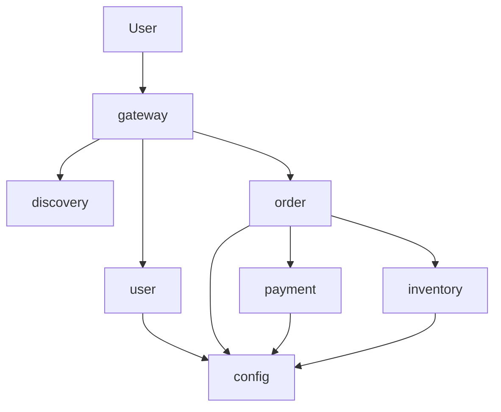
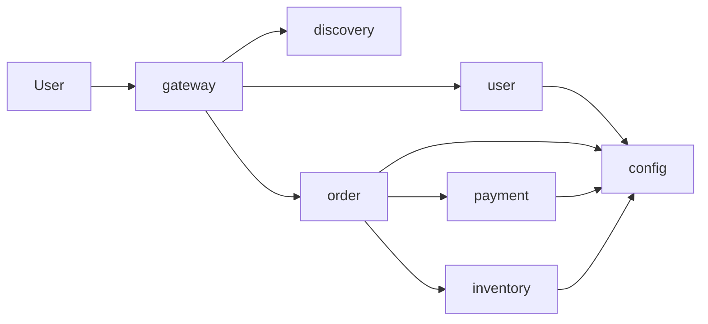
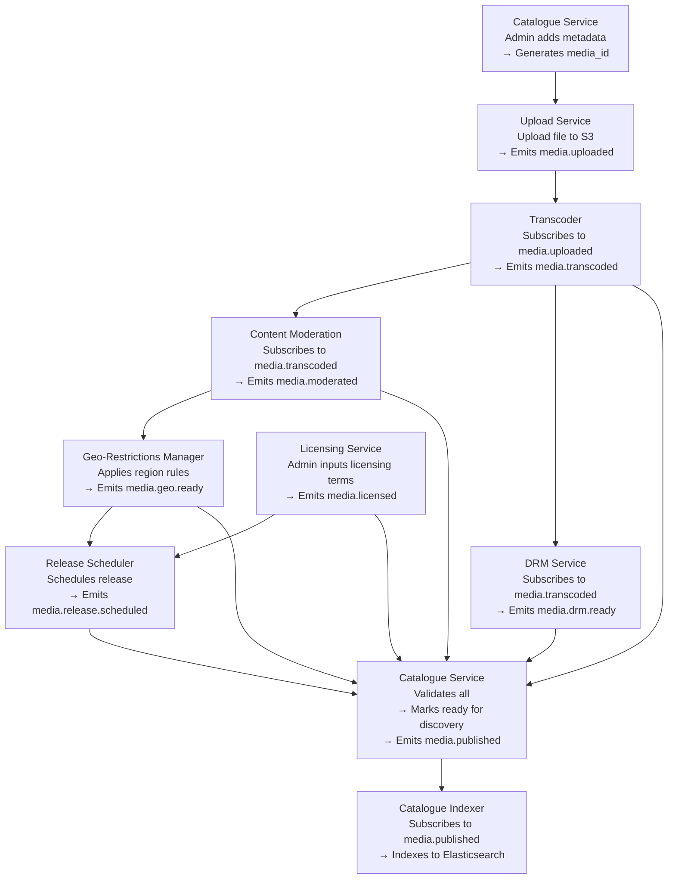

## Architecture

```mermaid
graph TD
    User --> gateway
    gateway --> discovery
    gateway --> user
    gateway --> order
    order --> inventory
    order --> payment
    user --> config
    order --> config
    payment --> config
    inventory --> config
```

rfer

```mermaid
graph LR
    User --> gateway
    gateway --> discovery
    gateway --> user
    gateway --> order
    order --> inventory
    order --> payment
    user --> config
    order --> config
    payment --> config
    inventory --> config
```

```mermaid
graph TD

A[Catalogue Service<br/>Admin adds metadata<br/>→ Generates media_id] --> B[Upload Service<br/>Upload file to S3<br/>→ Emits media.uploaded]
B --> C[Transcoder<br/>Subscribes to media.uploaded<br/>→ Emits media.transcoded]
C --> D[Content Moderation<br/>Subscribes to media.transcoded<br/>→ Emits media.moderated]
C --> E[DRM Service<br/>Subscribes to media.transcoded<br/>→ Emits media.drm.ready]
D --> F[Geo-Restrictions Manager<br/>Applies region rules<br/>→ Emits media.geo.ready]
G[Licensing Service<br/>Admin inputs licensing terms<br/>→ Emits media.licensed]
F --> H[Release Scheduler<br/>Schedules release<br/>→ Emits media.release.scheduled]
G --> H

C --> I[Catalogue Final Update]
D --> I
E --> I
F --> I
G --> I
H --> I

I[Catalogue Service<br/>Validates all<br/>→ Marks ready for discovery<br/>→ Emits media.published] --> J[Catalogue Indexer<br/>Subscribes to media.published<br/>→ Indexes to Elasticsearch]
```
