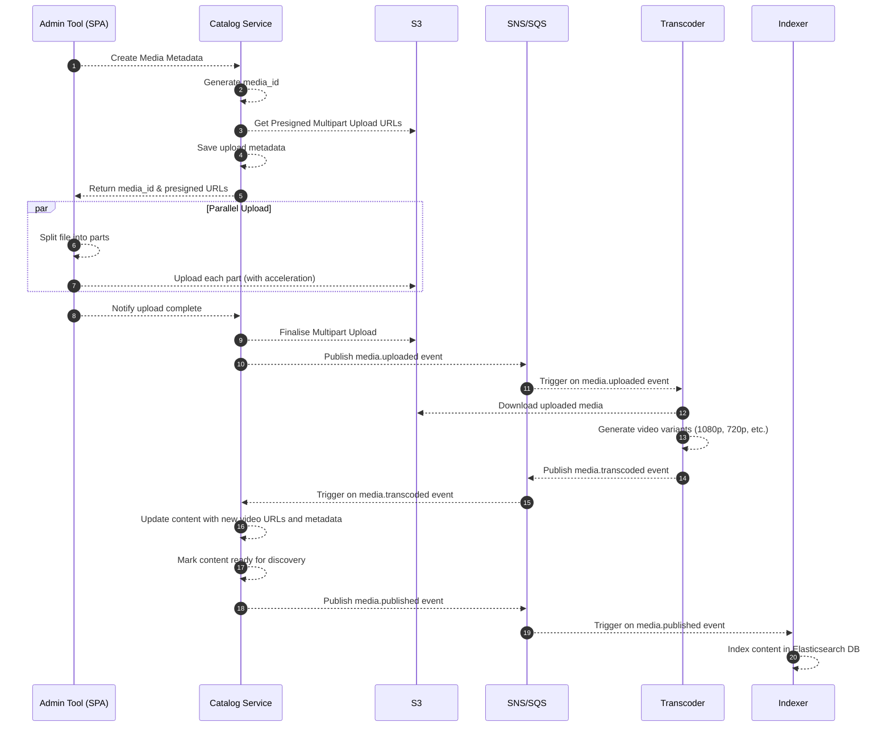

```mermaid
sequenceDiagram
  autonumber
  participant Admin Tool (SPA)
  participant Catalog Service
  participant S3
  participant SNS/SQS
  participant Transcoder
  participant Indexer

  Admin Tool (SPA)-->>Catalog Service: Create Media Metadata
  Catalog Service-->>Catalog Service: Generate media_id
  Catalog Service-->>S3: Get Presigned Multipart Upload URLs
  Catalog Service-->>Catalog Service: Save upload metadata
  Catalog Service-->>Admin Tool (SPA): Return media_id & presigned URLs

  par Parallel Upload
    Admin Tool (SPA)-->>Admin Tool (SPA): Split file into parts
    Admin Tool (SPA)-->>S3: Upload each part (with acceleration)
  end

  Admin Tool (SPA)-->>Catalog Service: Notify upload complete
  Catalog Service-->>S3: Finalise Multipart Upload
  Catalog Service-->>SNS/SQS: Publish media.uploaded event

  SNS/SQS-->>Transcoder: Trigger on media.uploaded event
  Transcoder-->>S3: Download uploaded media
  Transcoder-->>Transcoder: Generate video variants (1080p, 720p, etc.)
  Transcoder-->>SNS/SQS: Publish media.transcoded event

  SNS/SQS-->>Catalog Service: Trigger on media.transcoded event
  Catalog Service-->>Catalog Service: Update content with new video URLs and metadata
  Catalog Service-->>Catalog Service: Mark content ready for discovery
  Catalog Service-->>SNS/SQS: Publish media.published event

  SNS/SQS-->>Indexer: Trigger on media.published event
  Indexer-->>Indexer: Index content in Elasticsearch DB
```