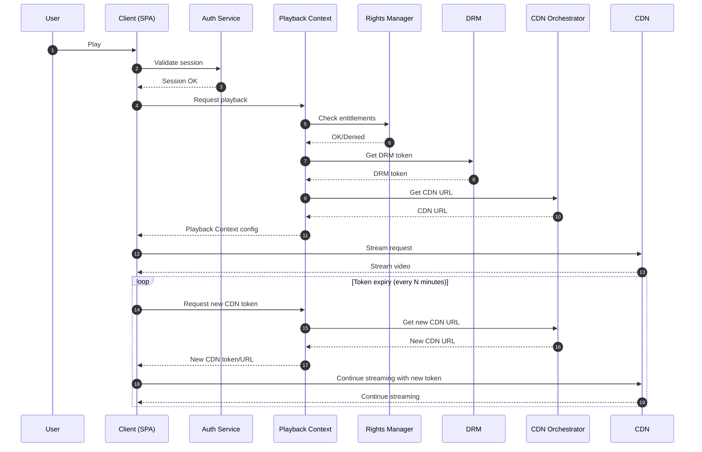

```mermaid
sequenceDiagram
  autonumber
  participant User
  participant Client (SPA)
  participant Auth Service
  participant Playback Context
  participant Rights Manager
  participant DRM
  participant CDN Orchestrator
  participant CDN

  User->>Client (SPA): Play
  Client (SPA)->>Auth Service: Validate session
  Auth Service-->>Client (SPA): Session OK
  Client (SPA)->>Playback Context: Request playback
  Playback Context->>Rights Manager: Check entitlements
  Rights Manager-->>Playback Context: OK/Denied
  Playback Context->>DRM: Get DRM token
  DRM-->>Playback Context: DRM token
  Playback Context->>CDN Orchestrator: Get CDN URL
  CDN Orchestrator-->>Playback Context: CDN URL
  Playback Context-->>Client (SPA): Playback Context config
  Client (SPA)->>CDN: Stream request
  CDN-->>Client (SPA): Stream video

  loop Token expiry (every N minutes)
    Client (SPA)->>Playback Context: Request new CDN token
    Playback Context->>CDN Orchestrator: Get new CDN URL
    CDN Orchestrator-->>Playback Context: New CDN URL
    Playback Context-->>Client (SPA): New CDN token/URL
    Client (SPA)->>CDN: Continue streaming with new token
    CDN-->>Client (SPA): Continue streaming
  end
```